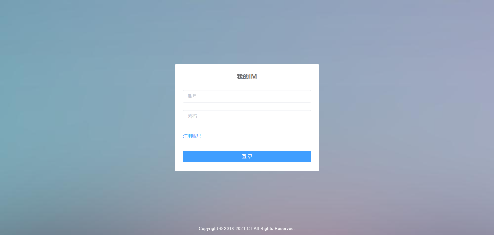
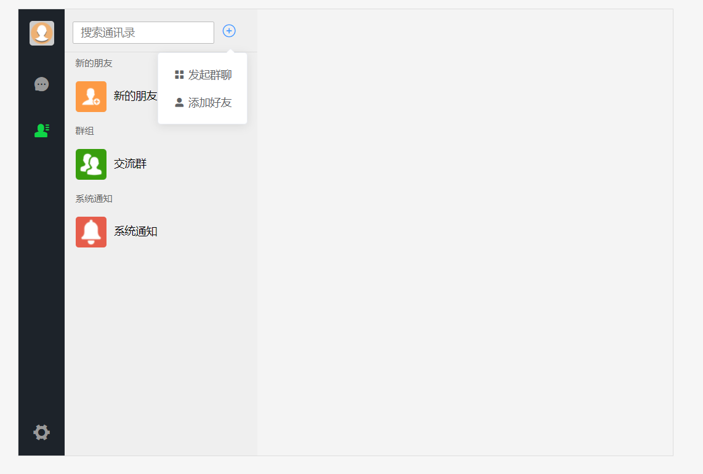
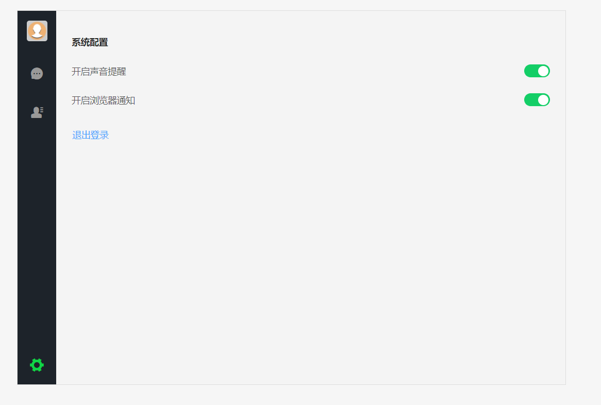

# t-im
     前后端分离的仿微信web im 在线聊天系统

github: https://github.com/caotaoX/t-im  
gitee:  https://gitee.com/ct_1466909669/t-im  

后端： spring boot , Hutool , netty , disruptor 等  
前端:  vue , axios, element-ui, lemon-imui  
- 前端最重要用到了 fanjyy 大佬开源的 lemon-imui 组件
- 地址：https://github.com/fanjyy/lemon-imui  

数据库、缓存：mongodb redis  

# 说明
    一直想做一个聊天系统，但奈何前端不是特别的好，有幸在码云看到fanjyy开源的仿微信vue组件，就开始搭建起自己的IM系统
    后端代码和表都是按照自己理解设计的，有兴趣的朋友们可以借鉴一下，哈哈哈。

体验地址：http://49.7.129.239:4100   
现有功能；
- 单点登录
- 用户注册
- 用户修改（点击头像）
- 添加加好友，好友管理。
- 创建群，群用户管理，群修改。
- 删除漫游聊天数据，消息撤回。
- 点击查看图片，右键下载图片和附件。
- 系统消息通知。
- 视频通讯。
- 共享屏幕。

